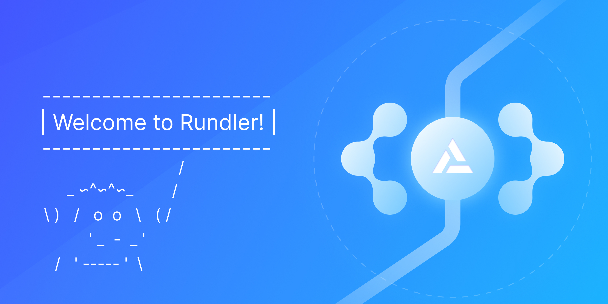

# Rundler

[![gh_ci_badge]][gh_ci_link]
[![tg_badge]][tg_link]

[gh_ci_badge]: https://github.com/alchemyplatform/rundler/workflows/ci/badge.svg
[gh_ci_link]: https://github.com/alchemyplatform/rundler/actions/workflows/ci.yml
[tg_badge]: https://img.shields.io/endpoint?color=neon&logo=telegram&label=chat&url=https://mogyo.ro/quart-apis/tgmembercount?chat_id=rundler
[tg_link]: https://t.me/rundler

**High-performance, modular implementation of an ERC-4337 bundler**



[Run](#running) | [Developer Docs](./docs)

🚧 *Under active development, see [status](#status) below.* 🚧

## Overview

**Rundler** (**R**ust B**undler**) is an [ERC-4337][eip_link] bundler implementation written in Rust. Rundler is designed to achieve high-performance and high-reliability in cloud deployments via a modular architecture. 

Built, maintained, and used by [Alchemy](https://www.alchemy.com/) to push the limits of user experience on EVM chains via [Account Abstraction](https://www.alchemy.com/blog/account-abstraction).

### Goals

Rundler is meant to power the ERC-4337 ecosystem with an implementation that users can rely on to scale to their needs while maintaining high reliability. As ERC-4337 is a nascent technology, Rundler strives to be on the bleeding edge of feature support and the team will be contributing to push the protocol forward.

Our goals with Rundler:

1. **ERC-4337 Specification Compliance**: Rundler strives to implement the full ERC-4337 specification and to maintain support as the specification changes and new onchain components are released. This includes new Entry Point contract support, support for the upcoming P2P mempool specification, support for alternative mempools, and more.
2. **High Performance and Reliability**:  Rundler strives to power the most demanding workloads in cloud environments. Rust was chosen for its high performance and memory safety. Rundler's modular architecture lets providers choose to run the stateless components (RPC, builder) in a fully horizontally scalable manner connecting to the stateful components (mempool, p2p, event cache) via the network. Rundler's bundle builder is designed to be able to support the full gas throughput of the network it's building for.
3. **Extendability/Chain Support**: ERC-4337 is designed to support any EVM chain. However, different EVM supporting networks have different rules around how they support things like gas usage, gas fees, precompiles, etc. Rundler is designed to be extendable and easily adapted to support any EVM chain.
4. **Modularity**: Rundler is written in a modular manner, allowing its components to be run as a single integrated binary, or as a distributed system. Rundler also strives for its individual crates to be used to support future ERC-4337 tooling.

## Status

Rundler is under active development. It is used in Alchemy's cloud to power Alchemy's Account Abstraction APIs. However, Rundler is rapidly being upgraded, features are being added, interfaces will have breaking changes, and the ERC-4337 spec is evolving from onchain learnings.

The documentation is work in progress, and we are working to improve it. Please [reach out](#help) with any questions.

**Use in production at your own risk.**

### ERC-4337 Entry Point Version Support

Rundler currently supports the following Entry Point versions:
  * [v0.6.0](https://github.com/eth-infinitism/account-abstraction/tree/v0.6.0)
  * [v0.7.0](https://github.com/eth-infinitism/account-abstraction/tree/v0.7.0)

See more on Entry Point support [here](docs/architecture/entry_point.md).

### Chain Support

Rundler has been tested on the following networks and their testnets:

* Ethereum
* OP Stack
    * Generally any OP stack chain should work.
    * Rundler has been explicitly tested on Optimism, Base, Zora, and Frax.
* Arbitrum Orbit
    * Generally any Arbitrum Orbit chain should work.
    * Rundler has been explicitly tested on Arbitrum One.
* Polygon POS

## Developers

### Contributing

See [CONTRIBUTING.md](CONTRIBUTING.md).

### Running

The easiest way to run Rundler is via a docker container. There is currently no pre-built image. See our [docker documentation](docs/docker.md) for further instructions.

### Developing

For detailed instructions see [developing](docs/developing.md).

Install [prerequisites](docs/developing.md#setup).

Clone the repository and checkout submodules:
```
git clone https://github.com/alchemyplatform/rundler
cd rundler
git submodule update --init --recursive
```

Run unit tests:
```
make test-unit
```

Run ERC-4337 spec tests:
```
# Only need to run once to install testing frameworks
cd test/spec-tests/v0_6/bundler-spec-tests && pdm install && pdm run update-deps
cd test/spec-tests/v0_7/bundler-spec-tests && pdm install && pdm run update-deps

# Run the v0.6 and v0.7 tests
make test-spec-integrated
```

### Help

If you have questions regarding the Rundler codebase, please first look through our [documentation](./docs/).

With further questions:

* [Github discussions](https://github.com/alchemyplatform/rundler/discussions)
* [Telegram][tg_link]
* [Github issues](https://github.com/alchemyplatform/rundler/issues/new/choose)

If you have questions regarding Alchemy's APIs or service, kindly refrain from discussion here. Please join the [Discord](https://discord.com/invite/alchemyplatform) or reach out to support@alchemy.com.

### Security

For security concerns do not file a public ticket, please reach out to security@alchemy.com.

See [SECURITY.md](SECURITY.md) for details.

## Acknowledgements

The work on this project would not have been possible without the amazing contributions from:

- [ERC-4337 team](https://github.com/eth-infinitism/account-abstraction): The ERC-4337 team has pioneered the standard, and has answered countless questions during our development. They developed the [bundler reference implementation](https://github.com/eth-infinitism/bundler) and [spec tests](https://github.com/eth-infinitism/bundler-spec-tests) that were invaluable during our development process. We are excited to continue to work with this team to push ERC-4337 ahead.
- [Reth](https://github.com/paradigmxyz/reth): Shout-out to the Reth team, from which we've taken inspiration for many of our practices in this repo (including this README). They are pushing the Ethereum Rust ecosystem forward in an open way. We thank the Reth team for their continued contributions.

[eip_link]: https://eips.ethereum.org/EIPS/eip-4337

## License

The Rundler library (i.e. all code outside of the `bin` directory) is licensed under the GNU Lesser General Public License v3.0, also included in our repository in the COPYING.LESSER file.

The Rundler binaries (i.e. all code inside of the `bin` directory) are licensed under the GNU General Public License v3.0, also included in our repository in the COPYING file.

Copyright 2023 Alchemy Insights, Inc.

Contact: Alchemy Insights, Inc., 548 Market St., PMB 49099, San Francisco, CA 94104; legal@alchemy.com
