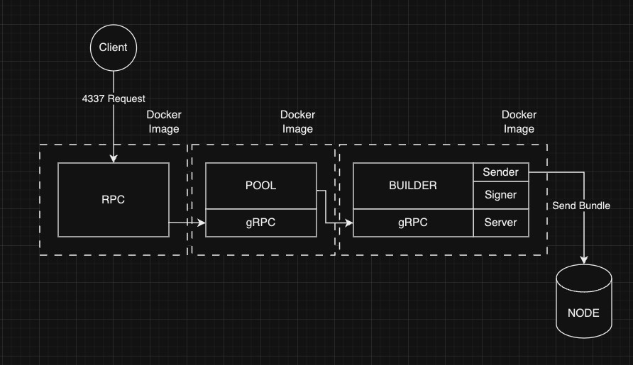
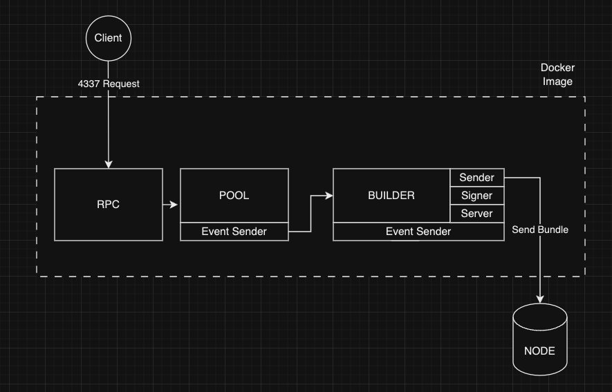

# Rundler Architecture

there are 3 main process that are execute when running the rundler application and they are `rpc`, `builder` and `pool`.

## RPC

The rpc module is used to expose a JSONRPC http api, much like a normal Ethereum node. To see the available requests, please refer to the [EIP4337 spec](https://eips.ethereum.org/EIPS/eip-4337) and find the RPC methods section. 

## Builder

The builder module is used to propose, send and track transactions that need to be bundled together and pushed onto the chain. There are 3 components to the builder module that have repsective purposes.
 
### Sender

The sender components function is to forward the bundled user operations to a node url or to a relay server (eg. Flashbots) if the chain is supported.

### Signer

The signer component is used to sign transactions before they are sent to be propogated on chain. The signing process can either be done by a key that is local to the server instance or an AWS KMS key.

### Server

The server component is a little bit more complex than the `sender` and the `signer` modules as there is a context of local or distributed options. The local server will work by passing messages between threads and listening to updates from the `pool`.
If the server is running in the distributed mode, messaging is done via gRPC which can be local to the machine or across multiple machines.

## Pool

The pool components purpose is to manage the mempool operations. Once a user operation is sent to the RPC server, the pool will add the operation to its mempool to be proposed via the builder and then to be propogated on chain.

## Distributed architecture

  

## Single Image architecture

  

