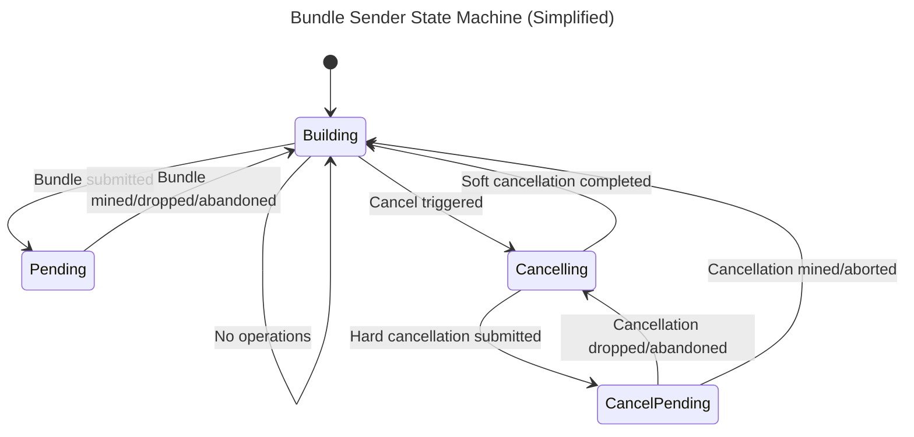

# Builder Task

The builder task is responsible for creating bundle transactions, signing them, submitting them, and tracking their status. 

## Bundle Sender

The bundle sender module is the main state machine that runs the bundle building logic. It follows the following steps:

1. Wait for a new block event from the `Pool`.
2. Request a new bundle from the [bundle proposer](#bundle-proposer).
3. Create and [sign](#transaction-signers) the bundle transaction.
4. Submit the transaction through a [transaction sender](#transaction-senders).
5. [Track](#transaction-tracking) the status of the bundle transaction, re-submitting if needed, until either the transaction is minded, or it is abandoned. Then return to 1.

## Bundle Proposer

The bundle proposer module's main responsibility is to construct a valid bundle transaction.

The proposer asks the `Pool` for pending user operations sorted by priority fee, filters them for profitability, re-simulates them and rejects invalid UOs, then optionally calculates any aggregated signatures.

### Required Fees

The proposer first estimates the required fees for the bundle transaction and then calculates the minimum required fees for a user operation. This calculation is based on a configuration option and is one of:

- **Priority Fee Increase Percent**: Require the UO priority fee to be N% higher than the bundle priority fee.
  - Configured via `--priority_fee_mode_kind=priority_fee_increase_percent --priority_fee_mode_value=N`

- **Base Fee Percent**: Require the UO priority fee to be N% of the base fee.
  - Configured via `--priority_fee_mode_kind=base_fee_percent --priority_fee_mode_value=N`

These can be tweaked to modify the bundler's profitability.

### Gas Limit

The proposer limits the amount of UO gas that it will attempt to put into a single bundle to ensure that transactions are below the gas cap of a block. This limit is calculated by summing the maximum gas usage of each UO in the bundle. If a UO puts the bundle over this limit, it (and all following UOs) will be skipped (but not removed from the pool).

The maximum gas usage of each UO is a function of its `preVerificationGas`, `verificationGasLimit`, and `callGasLimit`.

### 2nd Simulation and Rejection

Once a candidate bundle is constructed, each UO is re-simulated and validation rules are re-checked. UOs that fail are removed from the bundle and removed from the pool.

After 2nd simulation the entire bundle is validated via an `eth_call`, and ops that fail validation are again removed from the bundle. This process is repeated until the entire bundle passes validation.

NOTE: This procedure implements an old version of the spec and will be updated to conform soon. See [here](https://eips.ethereum.org/EIPS/eip-4337#bundling) for more details on the new implementation.

## Transaction Signers

The bundle builder supports a signer interface used for transaction signing. There are currently 2 implementations:

- **Private Key**: Rundler is configured with a private key via a CLI variable directly.

- [**KMS**](#kms-with-key-leasing): AWS KMS is used for signing.

### KMS with Key Leasing

When using AWS KMS for signing Rundler requires the use of Redis to perform key leasing.

To ensure that no two signers in a bundler system attempt to use the same key, causing nonce collisions, this key leasing system is used to lease a key in a CLI configured list to a single signer at a time.

## Transaction Senders
The builder supports multiple sender implementations to support bundle transaction submission to different types of APIs.

- **Raw**: Send the bundle as an `eth_sendRawTransaction` via a standard ETH JSON-RPC. If conditional RPC is enabled it will send the bundle as an `eth_sendRawTransactionConditional` to an interface that supports the [conditional transaction RPC](https://notes.ethereum.org/@yoav/SkaX2lS9j).

- **Flashbots**: Submit bundles via the [Flashbots Protect](https://docs.flashbots.net/) RPC endpoint, only supported on Ethereum Mainnet.

- **Bloxroute**: Submit bundles via Bloxroute's [Polygon Private Transaction](https://docs.bloxroute.com/apis/frontrunning-protection/polygon_private_tx) endpoint. Only supported on polygon.

## N-Senders

Rundler has the ability to run N bundle sender state machines in parallel, each configured with their own distinct signer/account for bundle submission.

In order for bundle proposers to avoid attempting to bundle the same UO, the sender is configured with a mempool shard index that is added to the request to the pool. This shard index is used by the pool to always return a disjoint set of UOs to each sender.

N-senders can be useful to increase bundler gas throughput.

## Sender State Machine

The bundle sender is implemented as an finite state machine to continuously submit bundle transactions onchain. The state machine runs as long as the builder process is running.

### States

**`Building`**

In the building state the sender is waiting for a trigger. Once triggered, the sender will query the mempool for available user operations. Those user operations are then filtered by the current fees, total gas limit, and simulation results. If before/after the filtering there are no candidate user operations, the sender will wait for another trigger. If there are candidate user operations, a bundle transaction is submitted. If a cancellation is required, the sender will transfer to the cancelling state.

**`Pending`**

In the pending state the builder is waiting for a bundle transaction to be mined. It will wait in this state for up to `max_blocks_to_wait_for_mine` blocks. If mined, dropped, or timed out (abandoned) the sender will transition back to the building state with the appropriate metadata captured.

**`Cancelling`**

In the cancelling state the builder creates a cancellation operation. The shape of this operation depends on the type of transaction sender being used. If a "hard" cancellation operation is submitted the sender will submit a cancellation transaction and transition to the cancel pending state. If a "soft" cancellation operation is submitted it will transition back to the building state immediately. 

**`CancelPending`**

In the cancel pending state the builder is waiting for a cancellation transaction to be mined. It will wait in this state for up to `max_blocks_to_wait_for_mine` blocks. If mined, the sender will transition back to the building state. If dropped or timed out (abandoned), the sender will transition back to the cancelling state. If the sender has already performed `max_cancellation_fee_increases`, and the transaction has been abandoned, it will transition back to the building state and reset internal state.

### Triggers

While in the building state the sender is waiting for a trigger. There are 3 types of triggers:

* New block (building mode: auto): Trigger bundle building when a new block is mined.
* Time (building mode: auto): Trigger bundle building after `bundle_max_send_interval_millis` (chain spec) has elapsed without a bundle attempt.
* Manual call (building mode: manual): Trigger bundle building on a call to `debug_bundler_sendBundleNow`.

### Cancellations

Cancellations occur in a specific scenario: there are user operations available that pay more than the estimated gas price, but when the sender submits the bundle transaction it receives a "replacement underpriced" error. If after increasing the fee the user operations are priced out, we are in an "underpriced" meta-state.

The first time the sender encounters this state it will capture the block number and attempt to create another bundle, resetting the fees. During subsequent encounters the builder will compare that block number to latest, if the difference is more than `max_replacement_underpriced_blocks`, the builder will move to a cancellation state.

The goal of the cancellation state is to remove the pending transaction from the mempool that is blocking the bundle submission, and to do so while spending the least amount of gas. There are two types of cancellations: "hard" and "soft." A "hard" cancellation requires a transaction to be sent onchain. This is typically an empty transaction to minimize costs. A "soft" cancellation does not require a transaction and is simply an RPC interaction.

### Diagram

